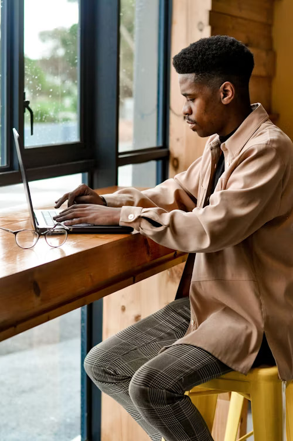

# Laban Lokeris - Personal Portfolio



A clean, responsive, and animated personal portfolio built with **vanilla HTML & CSS only** — no JavaScript, no frameworks. Designed and developed by **Laban Lokeris**, a UI Designer & Developer from Kenya.

🔗 **Live Preview**: [https://codewithlaban.github.io](https://codewithlaban.github.io)  
🎯 **Hackathon Submission**: Built entirely without JavaScript, using semantic HTML and modern CSS techniques.

---

## 🎯 Features

- ✅ **100% Vanilla HTML & CSS** – No JavaScript used (as per hackathon rules)
- ✅ **Mobile-First Responsive Design**
- ✅ **Pure CSS Mobile Menu** with hamburger toggle and overlay (using `:checked` + sibling selectors)
- ✅ **Smooth Scroll & Animations** on scroll using CSS `@keyframes` and `animation`
- ✅ **Accessible Navigation** with proper ARIA labels and keyboard support
- ✅ **Contact Form Ready** for integration (can be connected via Formspree or similar)
- ✅ **Optimized Performance** with image preloading and efficient CSS
- ✅ **Fully Themed** with custom color variables and consistent typography

---

## 🧱 Tech Stack

| Technology | Usage |
|----------|-------|
| **HTML5** | Semantic structure, accessibility, form handling |
| **CSS3** | Layouts, animations, transitions, variables, media queries |
| **Google Fonts** | Typography (`Manrope`) |
| **CSS Custom Properties** | Theme management (`:root` variables) |
| **Flexbox & Grid** | Responsive layouts |
| **Mobile-Only Navigation** | Checkbox hack for menu toggle without JS |

---

## 🎨 Design & Branding

- **Primary Color**: `--cinnamon-satin` (warm red) used for buttons and highlights
- **Secondary Accent**: Purple (`#c7b1dd`, `#a07cc5`) used in progress bars and tags
- **Typography**: Clean, modern `Manrope` font from Google Fonts
- **Animations**: Pure CSS slide-in effects on section reveal (`slideInTop`, `slideInLeft`, etc.)

All design decisions align with a modern, minimalist aesthetic focused on **user experience** and **visual clarity**.

---

## 📁 Project Structure
LABAN LOKERIS/
│
├── index.html                  # Main HTML file
├── favicon.svg                 # Favicon
│
├── assets/
│   ├── css/
│   │   └── style.css           # Main stylesheet
│   │
│   ├── cv/
│   │   └── laban-cv.pdf        # Resume/CV file
│   │
│   ├── icons/                  # SVG icons for social links, navbar, etc.
│   │
│   └── images/                 # Hero banner, project thumbnails, SVG masks
│       ├── hero-banner.jpg
│       ├── project-1.png
│       └── ...2,3,4.png
│
└── README.md                   # This file

## 📱 Responsive Behavior

| Breakpoint | Behavior |
|----------|---------|
| `< 575px` | Mobile layout, stacked content |
| `768px`   | Tablet grid (2-column) |
| `992px+`  | Desktop layout with horizontal navbar |
| `1400px+` | Full-width optimized layout |

The mobile menu uses the **checkbox of css** to toggle the navbar and overlay without JavaScript:
```html
<input type="checkbox" id="nav-toggle" class="nav-toggle-checkbox">
<label for="nav-toggle" class="nav-open-btn">☰</label>
<nav class="navbar">...</nav>
